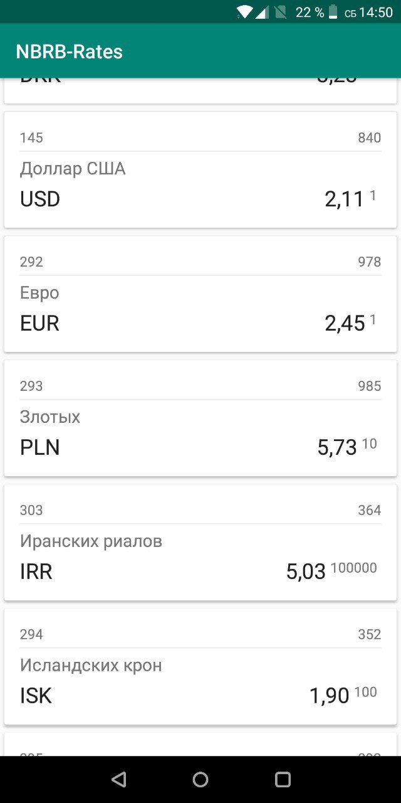
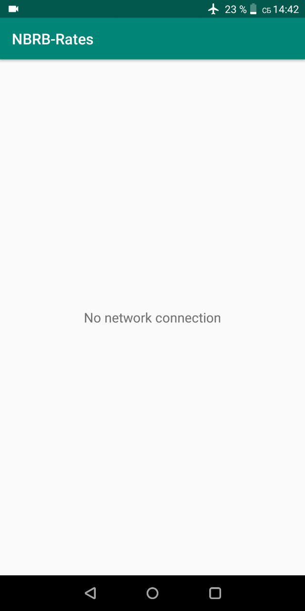

# [NBRB](https://www.nbrb.by/engl) exchange rates Android app

**NBRB-Rates** - one-day Kotlin Android application. Based on MVVM architecture using [Android Architecture components](https://developer.android.com/topic/libraries/architecture/) (LiveData, ModelView).

## Task
The application load all available exchange rates from [NBRB-endpoint](http://www.nbrb.by/Services/XmlExRates.aspx) and display it in a RecyclerView. It also able to handle *bad connection* and *endpoint(xml) error*. RecyclerView adapter allows to change items order.
By using Android LiveData the application is able to handle configuration changes without reloading data.

## Demo

  
  
  

## Used libraries
-   [AppCompat, CardView, RecyclerView](http://developer.android.com/intl/tools/support-library/index.html)
-   [Volley](https://developer.android.com/training/volley/)